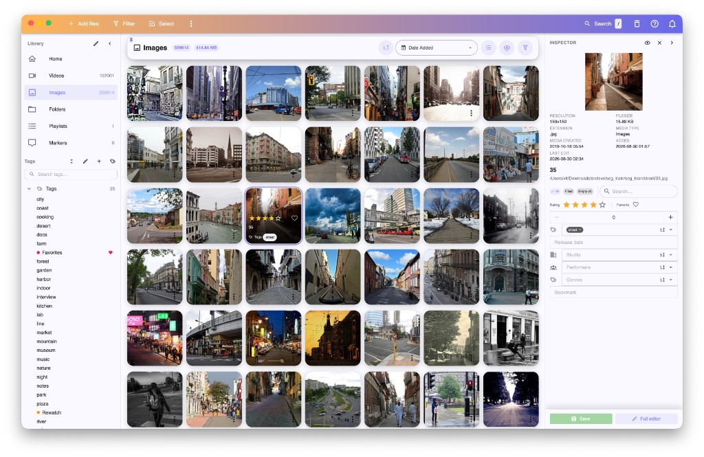

<p align="center">
  
</p>

<h1 align="center">MediaChips</h1>

<p align="center">
  <strong>Your media library, finally under control.</strong><br />
  Built for collections that outgrew folders.
</p>

<p align="center">
  <a href="https://mediachips.app">Website</a> ·
  <a href="https://github.com/fupdec/mediaChips/releases/latest">Download</a> ·
  <a href="https://github.com/fupdec/mediaChips/issues">Issues</a> ·
  <a href="https://discord.gg/dEQPper2yu">Discord</a> ·
  <a href="https://reddit.com/r/mediachips/">Reddit</a>
</p>

<p align="center">
  <a href="https://github.com/fupdec/mediaChips/blob/master/LICENSE"></a>
  <a href="https://github.com/fupdec/mediaChips/releases"></a>
  <a href="https://mediachips.app"></a>
</p>

<p align="center">
  
</p>

MediaChips is an open-source desktop app for **organizing, tagging, filtering, and browsing** local media — videos, images, audio, and text — without uploading anything to the cloud.

Attach the metadata that fits your collection (tags, ratings, favorites, custom fields), then find what you need with filters, global search, and a visual browser built for large libraries.

> **Private. Local. Yours.** MediaChips does not collect your data or send your library anywhere. Inspect the code, extend it with plugins, or self-host on your LAN / NAS.

---

## Why MediaChips?

- **Built for huge libraries** — browse and filter collections with hundreds of thousands of files
- **Completely local** — your files and metadata stay on your machine
- **Flexible metadata (chips)** — define the fields and tags that make sense for *your* library
- **Visual browsing** — cards, hover previews, storyboards, inspector, and an Eagle-style browser layout
- **Power tools** — duplicates, path-based tagging, CLIP semantic search, face tools, watched folders
- **Stash import** — bring scenes, performers, studios, tags, and markers into MediaChips
- **Windows · macOS · Linux · Docker / NAS**

---

## Download

**[⬇ Download the latest release](https://github.com/fupdec/mediaChips/releases/latest)**

macOS Gatekeeper / quarantine notes: [INSTALLATION.md](./INSTALLATION.md).

### Docker / Synology / NAS

```bash
cp .env.docker.example .env   # optional
docker compose up -d
# vinsdoe/mediachips:latest — open http://localhost:12321
# or: docker pull ghcr.io/fupdec/mediachips:latest
```

Full NAS setup (volumes, `PUID`/`PGID`, mounts): **[DOCKER.md](./DOCKER.md)**.

---

## Coming from Stash?

Install the **Stash import** plugin and import from your `stash-go.sqlite` database.

MediaChips can import **scenes, performers, studios, tags, and markers** (matched by path / oshash). Galleries, performer images, and some Stash-only structures are not a full 1:1 migrate — use MediaChips as the next home for your collection, not a drop-in Stash clone.

More: [mediachips.app](https://mediachips.app) · plugin docs in `plugins/official/stash/`.

---

## Features

### Browse

- Browser layout — tags sidebar, inspector, filters, compact controls
- Videos, images, audio, and text in one library
- Hover preview, storyboard / timeline grids, inline playback
- Multiple databases, tabs, playlists, LAN / mobile browser access

### Organize

- Custom **chips** (tags, ratings, favorites, bookmarks, dates, numbers, nested fields)
- Chip recipes — installable metadata presets
- Path tags & regex extraction, watched folders, bulk edit
- Duplicate finder (hybrid fingerprint + visual grid)

### Find

- Filter by any field or tag; saved filter presets
- Global search (`/`) across names and tags
- CLIP semantic search / Find scene (local models)
- Face detection & matching (optional, on-device)

### Extend

- Plugin system (Stash, Jellyfin, Plex, Emby, TMDB, Adult scrapers, …)
- Backup & restore
- Password protection · SFW mode
- 8 UI languages

---

## Community

- [Discord](https://discord.gg/dEQPper2yu)
- [Reddit r/mediachips](https://reddit.com/r/mediachips/)
- [Discussions](https://github.com/fupdec/mediaChips/discussions)
- [Issues](https://github.com/fupdec/mediaChips/issues)

Chip recipes (metadata schemas): see [`chip-recipes/`](./chip-recipes/).

---

## Build from source

### Requirements

- **Node.js** 18 or newer (LTS recommended)
- **npm** 9+
- Platform build tools for native modules (`better-sqlite3`, `ffmpeg-static`)

### Install

```bash
git clone https://github.com/fupdec/mediaChips.git
cd mediaChips
npm install
```

The ML path tag parser model is downloaded when building distribution packages. Face detection (SCRFD ~16 MB) and recognition (InsightFace R50 ~170 MB) are **not** bundled — users download them once from Face settings (or automatically on first detect/enroll/match). For local development, run `node scripts/compile.mjs scripts && node .scripts-build/download-parser-model.js` if you use path-based tag suggestions.

### Production (server + browser)

```bash
npm run build
npm run server
# open http://localhost:12321
```

LAN:

```bash
npm run server:lan
```

### Development

```bash
npm run build
npm run server:dev   # terminal 1 — API (nodemon)
npm run dev          # terminal 2 — Vite on http://localhost:3000
```

Copy or edit `public/config.json` after first server start if you need a LAN IP.

### Desktop (Electron)

```bash
npm run build
npm run electron
```

### Distribution packages

| Command | Description |
|---------|-------------|
| `npm run pack` | Unpacked app (`release/`) |
| `npm run dist` | Installers for the current platform |
| `npm run dist -- --mac` / `--win` / `--linux` | Installers for one platform |
| `npm run portable` | Windows portable build |

### Publishing a release (maintainers)

Desktop auto-update reads installers from [GitHub Releases](https://github.com/fupdec/MediaChips/releases).

1. Bump `version` in `package.json`.
2. Move `[Unreleased]` in `CHANGELOG.md` to `[X.Y.Z] - YYYY-MM-DD`.
3. Commit, then tag and push (`vX.Y.Z` must match `package.json`):

```bash
git tag v0.13.1
git push origin v0.13.1
```

4. The [Release workflow](.github/workflows/release.yml) builds Windows / macOS / Linux assets and updater manifests. Notes: tag must match version; portable Windows is not auto-updated; macOS community builds are ad-hoc signed ([INSTALLATION.md](./INSTALLATION.md)); Developer ID + notarize via [`build/mac-signing.env.example`](./build/mac-signing.env.example).

---

## npm scripts

| Script | Description |
|--------|-------------|
| `dev` | Vite hot reload |
| `build` | Frontend → `dist/` |
| `server` / `server:lan` / `server:dev` | Express backend |
| `electron` | Desktop shell |
| `pack` / `dist` / `portable` | Electron-builder packages |

---

## Project structure

```
api/            Database, migrations, controllers, routes
app/            Express server, tasks, defaults
databases/      Runtime SQLite DBs and generated images
dist/           Production frontend build
electron/       Electron preload
public/         Static assets, dev config
src/            Vue 3 frontend
models/         Optional ML models
scripts/        Build utilities
packages/       Official plugins (stash, jellyfin, …)
```

---

## Legacy Vue 2 branch

`master` is the Vue 3 rewrite (v0.13.0+). The old stack lives on `legacy/vue2` for reference only:

```bash
git checkout legacy/vue2
```

---

## Troubleshooting

### `better-sqlite3` and Electron

Need **better-sqlite3 12.4.2+**. The native module builds for one runtime at a time:

| Task | What happens |
|------|----------------|
| `npm run server` / `server:dev` | Rebuilt for Node on `postinstall` / start |
| `npm run electron` | Rebuilt for Electron via `scripts/ensure-electron-native.mjs` |

On `NODE_MODULE_VERSION` mismatch: `npm rebuild better-sqlite3` or `node scripts/ensure-electron-native.mjs --force`.

On macOS 15+ (esp. 26), AMFI may reject `linker-signed` natives — `ensure-electron-native.mjs` re-signs ad-hoc; or run `node scripts/sign-native-modules.mjs`.

### Electron and the `databases` folder

Keep backups before packaging, or store DBs outside the app bundle.

### macOS code signing

Community builds use **ad-hoc signing**. First launch: right-click → **Open**. See [INSTALLATION.md](./INSTALLATION.md).

---

## Contributing

1. Check [existing issues](https://github.com/fupdec/mediaChips/issues)
2. Open a new issue with repro steps or a clear feature request
3. Pull requests are welcome

---

## License

MediaChips is licensed under the [GNU General Public License v3.0](./LICENSE).

Copyright © 2020–2026 [MediaChips contributors](https://github.com/fupdec/mediaChips/graphs/contributors)
